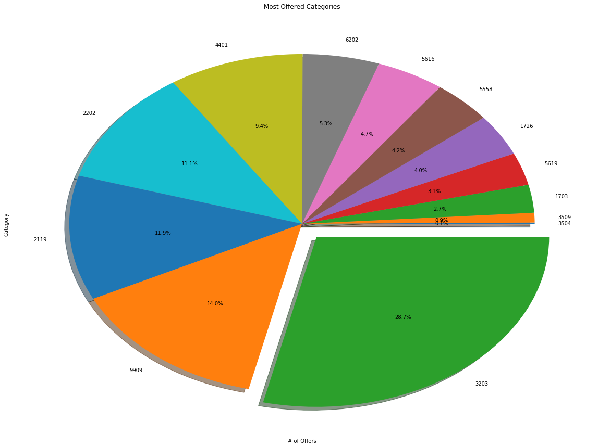
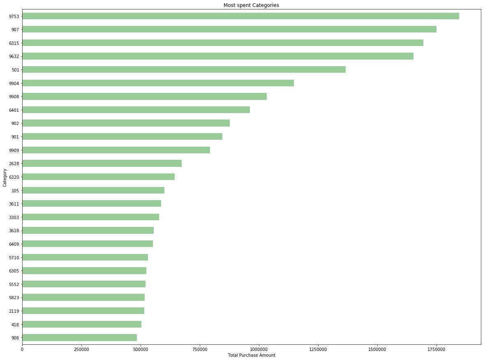

# Acquire Valued Customers

### Abstract

Businesses often face a challenge of retaining customers and converting them to be regular purchaser. As a Businesses strategy, companies and stores run discounted sales programs to attract more customers to be repeat purchasers and improve overall sales of the company.
  We use completely anonymized transactional data of customers along with offer details and History of offers given to customers.
  We will use the data to build a machine learning model and predict customers who will be repeat purchase of items when discounts are offered based on different features.

### Introduction

Background
Technology has created a huge shift in the way customers can buy products, to adapt to this change consumer brands are also changing their business models to acquire customers.
Consumer brands often offer discounts to attract new shoppers to buy their products. The most valuable customers are those who return after this initial incented purchase.  With enough purchase history, it is possible to predict which shoppers, when presented an offer, will buy a new item.
LAER is a sales term used in any business

-	**Land**: “All sales and marketing activities required to land the first sale of a solution to a new customer.” When you land the customer, you've successfully convinced the prospect to become a new customer of yours.
-	**Adopt**: “All activities involved in making sure the customer is successfully adopting and expanding their use of the solution.” This is the step where you help the customer that just bought your product.
-	**Expand**: “All activities required to cost-effectively help current customers expand their spending as usage increases, including both cross-selling and upselling.” As you become more invested in the customer’s outcomes, it becomes easier to tie your technology to other projects and initiatives, encouraging your customers to buy more products and services from you the supplier.
- **Renew**: “All activities required to ensure the customer renews their contract(s).” Convincing your customer to renew their relationship with you when it comes time to repurchase.

All the above aspects of sale are very important, but Renew is extremely critical for businesses to operate in long run.

Related to this is our project where store provides its customers with a discount offer and we will be predicting the possibility of customer returning to the store and buying the same item.

This will be a classification problem where a customer will repeat the purchase or will not be repeating the purchase.

We will be doing feature extraction and applying different machine learning models to derive AUC Score.

### About Data
The data set is obtained from Kaggle competition, which is publicly available in [kaggle](https://www.kaggle.com/c/acquire-valued-shoppers-challenge/data) 
Dataset has four relational files: 
- **transactions.csv** - contains transaction history for all customers for a period of at least 1 year prior to their offered incentive
- **trainHistory.csv** - contains the incentive offered to each customer and information about the behavioral response to the offer
- **testHistory.csv** - contains the incentive offered to each customer but does not include their response (predicting the repeater column for each id in this file)
- **offers.csv** - contains information about the offers

Transaction data has almost 350 million rows of completely anonymized data from over 300,000 shoppers along with offer information and History of offers given to customers.

The size of the dataset is 3GB.

Acquired dataset of 300K customer is reduced to manageable size of randomly picked 16000 customer records for EDA and Model building.

Download data for this project from below (extract the zip file)  
    [transactions](https://drive.google.com/file/d/1GQDqcLaRgLA7WpPkhTjD6gJ7MsgJDXJJ/view?usp=sharing) 
    [history](https://drive.google.com/file/d/1bQEaPp5WWUzMn19SgdpBkx-0FrxMKrss/view?usp=sharing) 
    [offers](https://drive.google.com/file/d/187pRzBYddjrSNlInz2R6liHKaQ99j-R-/view?usp=sharing) 
    

**Following are the features of the datasets**

All the fields are anonymized and categorized to protect customer and sales information. The specific meanings of the fields will not be provided (so don't bother asking). Part of the challenge of this competition is learning the taxonomy of items in a data-driven way.

**Transactions**
1.	id - A unique id representing a customer
2.	chain - An integer representing a store chain
3.	dept - An aggregate grouping of the Category (e.g. water)
4.	category - The product category (e.g. sparkling water)
5.	company - An id of the company that sells the item
6.	brand - An id of the brand to which the item belongs
7.	date - The date of purchase
8.	productsize - The amount of the product purchase (e.g. 16 oz of water)
9.	productmeasure - The units of the product purchase (e.g. ounces)
10.	purchasequantity - The number of units purchased
11.	purchaseamount - The dollar amount of the purchase

**History**
1.	id - A unique id representing a customer
2.	chain - An integer representing a store chain
3.	offer - An id representing a certain offer
4.	market - An id representing a geographical region
5.	repeattrips - The number of times the customer made a repeat purchase
6.	repeater - A boolean, equal to repeattrips > 0
7.	offerdate - The date a customer received the offer

**Offers**
1.	offer - An id representing a certain offer 
2.	category - The product category
3.	quantity - The number of units one must purchase to get the discount
4.	company - An id of the company that sells the item
5.	offervalue - The dollar value of the offer
6.	brand - An id of the brand to which the item belongs

### Data Exploration
Transactions were extracted for 16K customers out of 160K who were offered a discount coupon.

**Figure 1**
*shows, the histogram of returning customer distribution, we can see approximately 27% of customers have repeated purchase when given a discount*

**Figure 2**
*shows, a bar chart of top 25 categories with high transactions.*

**Figure 3**
*shows, a bar chart with number of customers to which each offer has been given.*

**Figure 4**
*shows, a bar chart with percentage of offers given for each of the categories.*

**Figure 5**
*shows, a bar chart shows top 25 popular categories based on purchase amounts spent.*

**Figure 6**
*shows, a bar chart shows categories with number of returning customers based on purchase amount.*

**Figure 7**
*shows, a correlation matrix which shows correlation between different features.
•	It can be observed that there is a strong correlation between repeater (true/false) and reteattrips.
•	There is also some correlation between retreater and category, company, brand, offer.
•	Market and chain features seems to have little correlation to repeater*

### Predictive Task

Our predictive task is to predict if the customers who are offered a discount coupon will return and become a repeat buyer.

**Baseline**

We establish base lines with given train history of customer who were offered discount offers. 

Logistic regression with 5-fold cross validation will result in AUC score of 0.5290.

**Validation** 

We will be validating our model and tuning the hyperparameters using a 5-fold cross validation. We randomly shuffled our data set and used 1/3 of the data points as test set. We partitioned the remaining data set into 5 splits. In each of the 5 iterations we trained our model on 4 splits and calculated the AUC score on the remaining split. Based on the average of 5 AUC, we fine-tuned our hyper parameters.

**Feature Extraction**

Based on above correlation matrix, the features which not correlated with target are excluded from model building.

Below features are extracted from provided dataset

Feature | Description 
--- | --- 
*total_trans_purchaseamount_avg* | `Average purchase amount of individual customer for offered category` 
*12_mnths_total_purchase_amt* | `12 months spending by customer before offerdate`
*9_mnths_total_purchase_amt* | `9 months spending by customer before offerdate`
*6_mnths_total_purchase_amt* | `6 months spending by customer before offerdate`
*3_mnths_total_purchase_amt* | `3 months spending by customer before offerdate`
*1_mnths_total_purchase_amt* | `1 months spending by customer before offerdate`
*total_transactions_count* | `Total transactions by customer`
*total_purchaseamount* | `Total purchase amount by customer`
*total_purchasequantity* | `Total quantity of items purchased`
*total_purchase_company_count* | `Total number of purchases of a product belonging to offered company`
*total_purchase_category_count* | `Total number of purchases of product of the category`
*purchaseamount_category_avg* | `Average spending on offered category`
*offeredmonth* | `Month in which offers where give to customers`
*category_purchased_amt_30days* | `Total purchase amount spent on category in last 30 days before offerdate`
*category_purchased_qty_30days* | `Total purchased quantity of category in last 30 days before offerdate`
*category_purchased_amt_90days* | `Total purchase amount spent on category in last 90 days before offerdate`
*category_purchased_qty_90days* | `Total purchased quantity of category in last 90 days before offerdate`
*category_purchased_amt_180days* | `Total purchase amount spent on category in last 180 days before offerdate`
*category_purchased_qty_180days* | `Total purchased quantity of category in last 180 days before offerdate`
*category_purchased_amt_270days* | `Total purchase amount spent on category in last 270 days before offerdate`
*category_purchased_qty_270days* | `Total purchased quantity of category in last 270 days before offerdate`
*company_purchased_amt_30days* | `Total purchase amount spent on product of a company in last 30 days before offerdate`
*company_purchased_qty_30days* | `Total purchased quantity of product of a company in last 30 days before offerdate`
*company_purchased_amt_90days* | `Total purchase amount spent on product of a company in last 90 days before offerdate`
*company_purchased_qty_90days* | `Total purchased quantity of product of a company in last 90 days before offerdate`
*company_purchased_amt_180days* | `Total purchase amount spent on product of a company in last 180 days before offerdate`
*company_purchased_qty_180days* | `Total purchased quantity of product of a company in last 180 days before offerdate`
*company_purchased_amt_270days* | `Total purchase amount spent on product of a company in last 270 days before offerdate`
*company_purchased_qty_270days* | `Total purchased quantity of product of a company in last 270 days before offerdate`
*brand_purchased_amt_30days* | `Total purchase amount spent on product of a brand in last 30 days before offerdate`
*brand_purchased_qty_30days* | `Total purchased quantity of product of a brand in last 30 days before offerdate`
*brand_purchased_amt_90days* | `Total purchase amount spent on product of a brand in last 90 days before offerdate`
*brand_purchased_qty_90days* | `Total purchased quantity of product of a brand in last 90 days before offerdate`
*brand_purchased_amt_180days* | `Total purchase amount spent on product of a brand in last 180 days before offerdate`
*brand_purchased_qty_180days* | `Total purchased quantity of product of a brand in last 180 days before offerdate`
*brand_purchased_amt_270days* | `Total purchase amount spent on product of a brand in last 270 days before offerdate`
*brand_purchased_qty_270days* | `Total purchased quantity of product of a brand in last 270 days before offerdate`
*purchased_company_category_brand_count* | `Number of times product of offered company, category and brand is purchased`
*purchased_company_category_count* | `Number of times product of offered company and category is purchased`

### Models

We run different models to predict the repeat buyers, we explored different types of parametric models based on the features mentioned above. Since this is a classification problem, we will choose a classifier that can efficiently train our model, while considering that we have 16000 customer data in our training set and around 60 features.

### Evaluating the Model
We will be evaluating the model on the AUC Score.
AUC stands for "Area under the ROC Curve." That is, AUC measures the entire two-dimensional area underneath the ROC curve.

AUC is the probability that the model ranks a random positive example more highly than a random negative.

### Logistic Regression 
Logistic regression measures the relationship between the categorical dependent variable and one or more independent variables by estimating probabilities using a logistic function, which is the cumulative logistic distribution. 
In simple terms, Logistic regression predicts class (0|1) for specified sample, by drawing a line in feature space that divides the '1' samples from the '0' samples. In other words, we wish to find the "regression" line which divides the samples.

### Decision Tree Classifier
A decision trees are a non-parametric supervised learning method, the goal is to create a model that predicts the value of a target variable by learning simple decision rules inferred from the data features.

### Random Forest
A random forest is a meta estimator that fits several classifying decision trees on various sub-samples of the dataset. To improve the predictive accuracy and control over-fitting, averaging is used. We trained our model using Sklearn random forest library for different values of n_estimators

### Results
Model | AUC 
--- | --- 
*Logistic Regression* | `0.5290` 
*Decision Tree* | `0.5621`
*Random Forest* | `0.6599`

### Conclusion

**Factors Influencing customers to repeat purchases**
-	Average customer spending
-	Recent Purchase trends of customer
-	History of Category, Company, Brand purchases by customer
